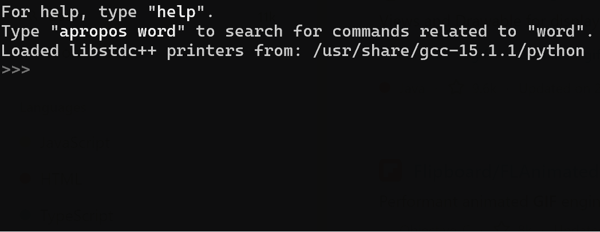
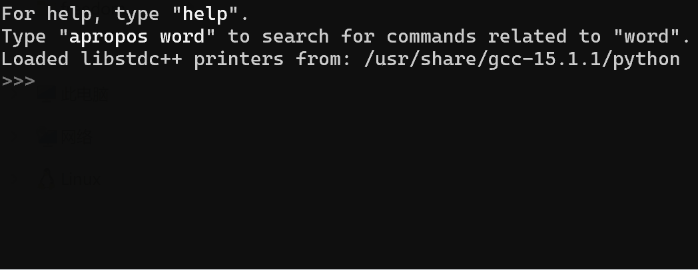
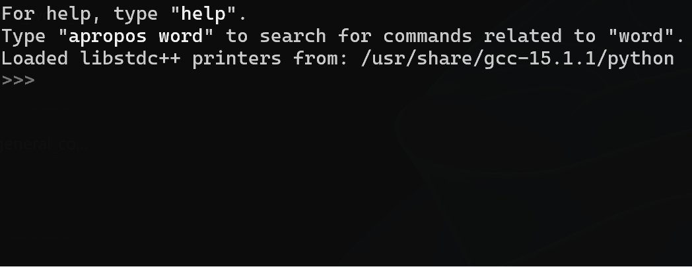
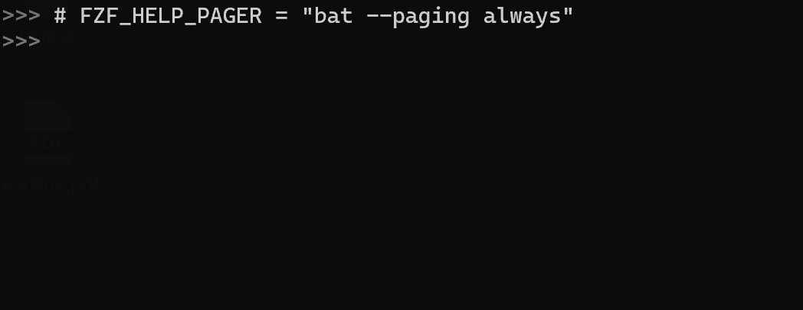

# GDB-FZF: GDB with FZF

GDB-FZF enhances the GDB command line by integrating [fzf](https://github.com/junegunn/fzf), the powerful command-line fuzzy finder. It provides a fast and intuitive way to search command history, discover commands, and navigate tab completions.

|                    Disable Help Preview                     |                    Enable Help Preview                    |
| :---------------------------------------------------------: | :-------------------------------------------------------: |
|  |  |

|                              Disable Longest Common Prefix Completion                               |                              Enable Longest Common Prefix Completion                              |
| :-------------------------------------------------------------------------------------------------: | :-----------------------------------------------------------------------------------------------: |
|  |  |

|                           Disable Only List Completion Field                            |                           Enable Only List Completion Field                           |
| :-------------------------------------------------------------------------------------: | :-----------------------------------------------------------------------------------: |
|  |  |

|   GDB Command Help with Pager (Alt-h)   |
| :-------------------------------------: |
|  |

## Features

  - **History Search (`Ctrl-r`):** Instantly fuzzy search your entire GDB command history with fzf.
  - **Command Search (`Alt-c`):** Find any GDB command without knowing its exact name.
  - **Tab Completion (`Tab`):** Enhances GDB's native completion. It first completes the longest common prefix, and if multiple options remain, it opens an fzf menu to interactively filter and select the final choice.
  - **Live Command Preview:** When searching commands, an optional preview window displays the GDB help text for the highlighted item.

## Requirements

  - **GDB** with Python 3 support.
  - **fzf** installed and available in your system's `PATH`.
  - **Dynamically Linked Readline:** The script requires access to GDB's readline symbols, which is standard for most GDB builds.

## Installation

1.  **Save the Script:**
    Save the code as `gdb-fzf.py` in your GDB configuration directory (e.g., `~/.gdb/gdb-fzf.py`).

2.  **Load in GDB:**
    Add the following line to your `~/.gdbinit` file. This is the recommended way to load it automatically.

    ```gdb
    source ~/.gdb/gdb-fzf.py
    ```

    *(Replace `~/.gdb/gdb-fzf.py` with the actual path if you saved it elsewhere.)*

## Usage

Once loaded, the following keybindings are active in the GDB prompt:

| Keybinding      | Action                                                                   |
| :-------------- | :----------------------------------------------------------------------- |
| **`Ctrl-r`**    | Open fzf to search command history.                                      |
| **`Alt-c`**     | Open fzf to search all available GDB commands.                           |
| **`Tab`**       | Trigger GDB's completion. If multiple options exist, fzf will open.      |

Once fzf startup, the following keybindings are active in the FZF prompt:

| Keybinding      | Action                                                                   |
| :-------------- | :----------------------------------------------------------------------- |
| **`Tab`**       | Move selection down                                                      |
| **`Shift-Tab`** | Move selection up                                                        |
| **`Alt-h`**     | Show GDB command help in pager view                                      |

In the fzf window, type to filter, use `Enter` to select, and `Esc` to cancel. For advanced search patterns, see the official [fzf search syntax guide](https://github.com/junegunn/fzf?tab=readme-ov-file#search-syntax).

## Configuration

You can customize behavior by editing the global variables at the top of `gdb-fzf.py`:

  - **`READLINE_LONGEST_COMMON_PREFIX_COMPLETION`**:
    Set to `False` to disable longest common prefix completion.

    ```python
    READLINE_LONGEST_COMMON_PREFIX_COMPLETION = True
    ```

  - **`FZF_PREVIEW`**:
    Set to `False` to disable the command help preview window.

    ```python
    FZF_PREVIEW = True
    ```

  - **`FZF_ONLY_LIST_COMPLETION_FIELD`**:
    Set to `False` to disable only list completion filed in fzf.

    ```python
    FZF_ONLY_LIST_COMPLETION_FIELD = True
    ```

  - **`FZF_HELP_PAGER`**:
    Configures the pager used to display GDB command help documentation.

    ```python
    FZF_HELP_PAGER = "less -i"
    ```

  - **`FZF_ARGS`**:
    A list of command-line arguments passed to fzf. Modify this to change fzf's appearance or behavior (e.g., `--height`, `--layout`).

    ```python
    FZF_ARGS = [
        'fzf',
        '--height=40%',
        # ... other args
    ]
    ```

## Troubleshooting

  - **`gdb-fzf: ... Is fzf installed and in your PATH?`**
    Ensure the `fzf` executable is installed and its location is in your `$PATH`.

  - **`Failed to resolve the following required symbols: ...`**
    This script requires a dynamically linked GDB to access readline functions. This error is rare but may occur with custom or static GDB builds.

  - **Keybindings do not work:**

      - Check for error messages when GDB starts to see if the script failed to load.
      - Ensure other GDB scripts are not overriding the `Ctrl-r` or `Alt-c` bindings.
      - Note that `Alt-c` may require pressing `Escape` then `c` in some terminals.

## License

This project is forked and improved from [plusls/gdb-fzf](https://github.com/plusls/gdb-fzf). Please refer to the original repository for license details.
